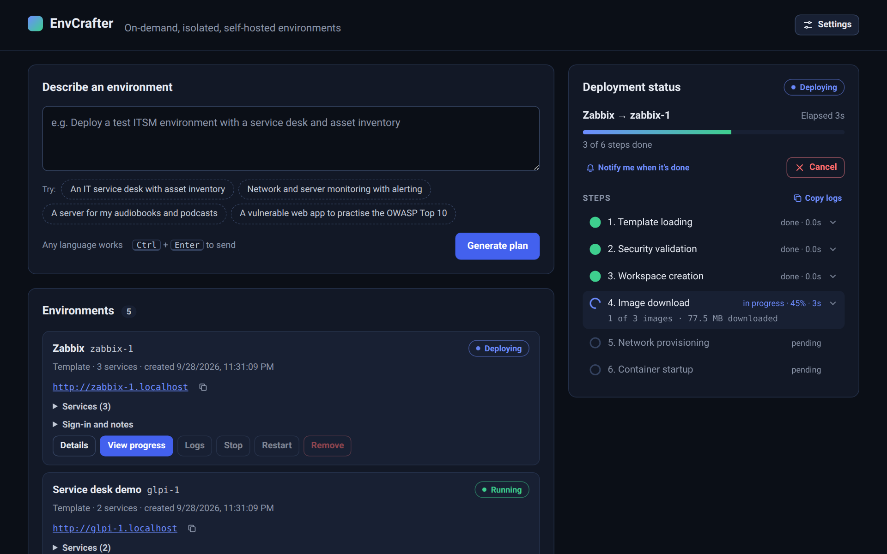
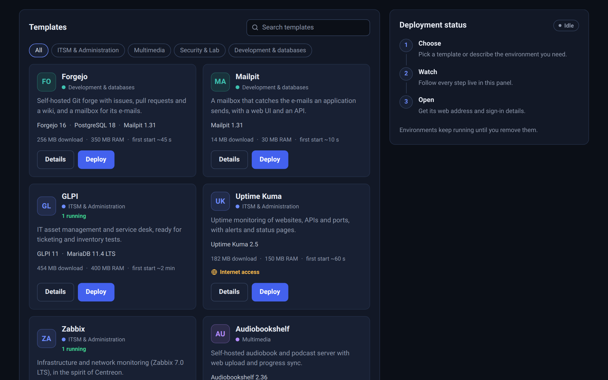
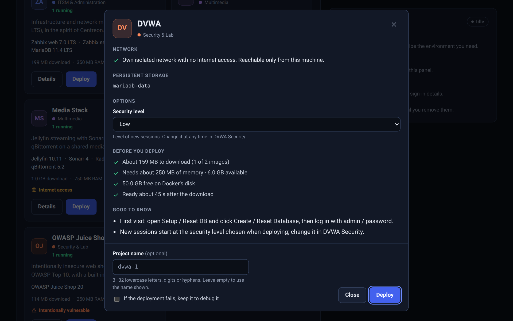
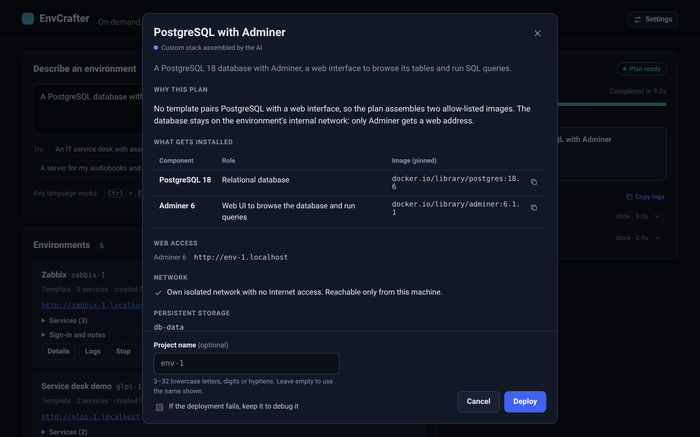
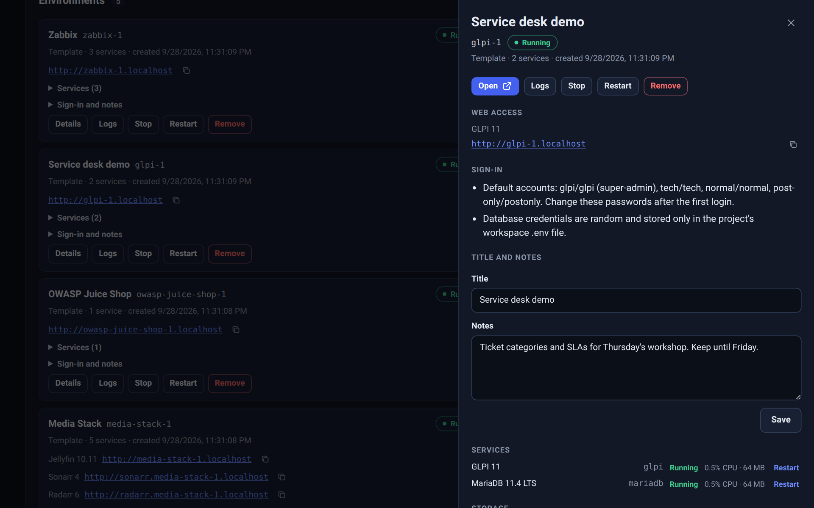

# EnvCrafter

[](https://github.com/stvn-tss/envcrafter/actions/workflows/ci.yml)

EnvCrafter is a self-hosted "personal PaaS": describe the environment you want
in plain English, or pick one from the built-in catalog, and EnvCrafter
validates the stack against a strict security policy, writes an isolated
Docker Compose workspace for it, and deploys it — streaming every step (image
downloads, health checks, failures) to a web UI in real time.



## Features

- **Template catalog** — nine ready-to-deploy stacks across four categories
  (ITSM, multimedia, security labs, development), each with its footprint and
  how to sign in; some take options chosen before deploying.
- **Requests in plain English** — Claude turns what you describe into a stack,
  and you review the plan (components, images, network access, storage) before
  anything is deployed. Without an API key, the same box finds the closest
  templates.
- **One security gate for every stack** — templates and AI plans pass the same
  strict policy: pinned, allow-listed images only; no privileged containers, no
  host mounts, no access to the Docker socket.
- **Isolated environments** — each environment gets its own network; Internet
  access and web routing are opt-in, per service.
- **Ready before you deploy** — what a template needs (download, memory, disk
  space, time to start) is checked against your machine, and a setup check
  greets the first visit.
- **Live progress** — every step streams to the browser, from image downloads
  to health checks. A failed deployment shows the last log lines of what went
  wrong (secrets redacted) and is rolled back, unless you keep it to debug it;
  any deployment can be cancelled.
- **Environments dashboard** — state, web addresses, sign-in details, CPU and
  memory, container logs (secrets redacted), your own notes and an activity
  history; stop, start, restart or remove each environment.
- **Durable history** — job summaries, AI plans and an audit log survive
  restarts.
- **Comfort** — light and dark themes, optional browser notifications when a
  long deployment ends, and each environment set to your browser's time zone.

## How it works

Every deployment — from a template or from an AI-generated plan — goes
through the same pipeline:

```
template lookup           ┐
      or          → security validation → workspace → image download
AI analysis        ┘              → networks & containers → startup
```

- **Checked before anything runs** — a stack must pass the security policy
  before its workspace is written or its images are downloaded.
- **All or nothing** — a failure at any later step removes everything created
  for the environment (containers, networks, volumes, workspace files), unless
  you asked to keep it for debugging. A cancelled deployment is always rolled
  back.
- **On your machine only** — each environment is served at
  `http://<project>.localhost` by a reverse proxy (Traefik) that listens on
  `127.0.0.1` only.
- **Least privilege** — EnvCrafter never touches the Docker socket itself: it
  goes through a filtering proxy that never lets it run code inside a container
  or build an image.

The [documentation](docs/DOCUMENTATION.md) details the architecture and the
security model.

## Screenshots

<table>
  <tr>
    <td width="50%" valign="top">
      
      <p align="center"><b>Template catalog</b></p>
    </td>
    <td width="50%" valign="top">
      
      <p align="center"><b>Options and capacity check</b></p>
    </td>
  </tr>
  <tr>
    <td width="50%" valign="top">
      
      <p align="center"><b>AI plan review</b></p>
    </td>
    <td width="50%" valign="top">
      
      <p align="center"><b>Environment details</b></p>
    </td>
  </tr>
</table>

## Quick start

Prerequisites: Docker Desktop or Docker Engine with Compose v2+.

```bash
git clone https://github.com/stvn-tss/envcrafter.git
cd envcrafter
docker compose -f deploy/docker-compose.yml up -d --build
```

Then open http://envcrafter.localhost and deploy a template.

Describing environments in plain English needs a Claude API key: add it in
**Settings → Claude API key**, or in a `.env` file (see
[Configuration](docs/DOCUMENTATION.md#configuration)). Templates work without
one.

To work on EnvCrafter itself, a development server runs the whole pipeline
with a simulated engine, without Docker: see
[Development](docs/DOCUMENTATION.md#development).

## Templates

| Template | Category | Components | Download | Memory | First start |
|---|---|---|---|---|---|
| GLPI | ITSM & Administration | GLPI, MariaDB | 454 MB | 400 MB | ~120 s |
| Zabbix | ITSM & Administration | Zabbix web, Zabbix server, MariaDB | 199 MB | 350 MB | ~90 s |
| Uptime Kuma | ITSM & Administration | Uptime Kuma | 182 MB | 150 MB | ~60 s |
| Audiobookshelf | Multimedia | Audiobookshelf | 115 MB | 150 MB | ~20 s |
| Media Stack | Multimedia | Jellyfin, Sonarr, Radarr, Prowlarr, qBittorrent | 1048 MB | 750 MB | ~60 s |
| DVWA | Security & Lab | DVWA, MariaDB | 318 MB | 250 MB | ~45 s |
| OWASP Juice Shop | Security & Lab | OWASP Juice Shop | 114 MB | 250 MB | ~30 s |
| Forgejo | Development & databases | Forgejo, PostgreSQL, Mailpit | 256 MB | 350 MB | ~45 s |
| Mailpit | Development & databases | Mailpit | 14 MB | 30 MB | ~10 s |

Footprints are approximate (`linux/amd64`, images already downloaded). To add
your own template, see [Adding a template](docs/DOCUMENTATION.md#adding-a-template).

## Current limitations

Some of these may be lifted in future versions: the [roadmap](ROADMAP.md)
lists what is planned.

- **Localhost only** — there is no built-in authentication: do not expose
  EnvCrafter beyond `127.0.0.1` without putting an authenticating proxy in
  front of it.
- **Linux containers only.**
- **A single API worker** — the real-time event bus is in-process: run a
  single Uvicorn worker.
- **Job details kept for about an hour** — the step-by-step events of a job
  stay in memory for about one hour; its summary is kept in the history.
  Durable truth is always the workspace files and the Docker state.
- **No volume sizes** — reading them needs Docker's system endpoint, which the
  API's socket proxy does not allow.
- **Windows** — Docker Desktop on Windows is supported through the
  containerized control plane; the local development server always runs the
  simulated engine and never deploys real containers.

## Documentation

- [Technical documentation](docs/DOCUMENTATION.md): architecture, security
  model, configuration, API, adding a template, development and tests.
- [Roadmap](ROADMAP.md): what comes next, and what is already done.

## License

EnvCrafter is released under the [MIT License](LICENSE). Templates deploy
third-party software under their own licenses.
